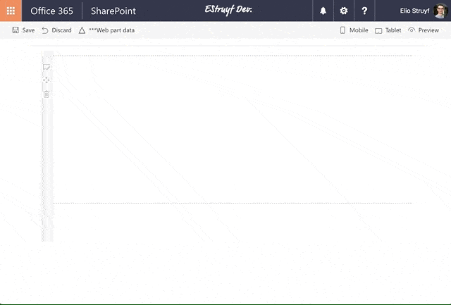
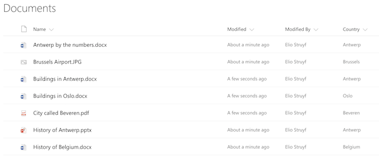

# SharePoint Framework PnP Controls Sample

This is a sample project that contains a web part which makes use of the PnP SPFx Controls:

- [SharePoint Framework React Controls](https://www.npmjs.com/package/@pnp/spfx-controls-react)
- [SharePoint Framework Property Controls](https://www.npmjs.com/package/@pnp/spfx-property-controls)



## What is being used in this sample?

The sample makes use of the following controls:
- PropertyFieldListPicker
- PropertyFieldTermPicker
- Placeholder
- ListView (which also uses the FileTypeIcon control)

## How to test this web part

To test out this web part, you need to have a library with a managed metadata field. In my case, I made use of a field called **Country**.



Once you have such a library in place, you can use this web part as follows:

```bash
git clone https://github.com/estruyf/spfx-pnp-controls-sample.git
cd spfx-pnp-controls-sample
npm install
gulp serve --nobrowser
```
